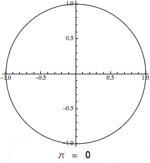

Monte Carlo Bakery
==================

 

Serving yummy, fresh digits of π daily!

Croissant in Code?
------------------

Not quite. This script demonstrates the popular [Monte Carlo
method](http://en.wikipedia.org/wiki/Monte_Carlo_method) in an
application that uses basic probability and geometry to approximate the
constant Pi.

To try it yourself, run:

    python bake_pi.py

My implementation employs multiprocessing, so it will devour a decent
chunk of your CPU. You can watch the approximation fluctuate as the
simulation runs, but you'll soon realize that the simulation converges
on even the first few digits only after a *very* long time. More on that
below.

A Delicious History Lesson
--------------------------

The [mathematical constant pi](http://en.wikipedia.org/wiki/Pi) is an
[irrational number](http://en.wikipedia.org/wiki/Irrational_number), so
by definition, it cannot be expressed as a ratio of two integers.
However, because of its many applications it is useful to have accurate
representations of Pi. Greek mathematician
[Archimedes](http://en.wikipedia.org/wiki/Archimedes) developed the
method that dominated for the first millennium, which involved
calculating the perimeter of n-sided polygons. The best approximation
was calculated by Ptolemy and was accurate to only 4 digits. Five
centuries later, Chinese mathematician [Zu
Chongzi](http://en.wikipedia.org/wiki/Zu_Chongzhi) applied method with a
12,288-sided polygon and arrived at an approximation accurate to 7
digits.

It wasn't until the 16th and 17th century that mathematicians discovered
infinite series representations of Pi and used them to approximate 71
digits. However, many of the series used had slow convergence rates,
that is to say that each digit costed significantly more to compute.
Notably, British mathematician [William
Shanks](http://en.wikipedia.org/wiki/William_Shanks) dedicated 15 years
of his life to calculate the first 707 digits of Pi. Unfortunately,
nearly a quarter of his labors was discovered to be incorrect when
mathematicians later identified a miscalculation in his 528th digit,
which propogated through all 179 digits that followed it.

These records were quickly shattered with the advent of modern
computing. The [ENIAC](http://en.wikipedia.org/wiki/ENIAC) (which for
perspective had a clock speed of 100 kHz and could barely be stuffed
into today's average home) was able to calculate over 2,000 digits after
70 hours of computations.

Most modern approaches today use a hybrid of infinite series and
iterative algorithms. Mathematicians have been able to calculate 13.3
trillion digits.

Why not the MGM Grand Model?
----------------------------

The Monte Carlo model was a term coined by Nicholas Metropolis, a
colleague of John von Neumann, who was working on a secret project which
used the then unnamed Monte Carlo model.

The model is defined by the use of random sampling to perform a
calculation that would otherwise be difficult or even impossible with
pure math alone (like calculating many digits of Pi).

Warning: Math Ahead
-------------------

 

This algorithm hinges on key equations from geometry and probabilty.
Namely, consider circle with radius
 centered at
the origin. We know from primary school geometry that the area of this
circle is .
Next, circumscribe the circle with a square of side length
. It's area
is
.

At this point, if we were to randomly choose a point in the square, what
would be the chances that this point would also be inside the square?
Basic probability tells us that this is simply the ratio of the area of
the circle to the area of the rectangle. So,

We will exploit this relationship to find the value of Pi. In applying
the Monte Carlo model, we choose points uniformly distributed between
")
and
").
Then, by using the Euclidean distance formula ^2 + \left ( y_1-y_2 \right )^2} < r^2"),
we can determine which of these points lie within the circle and
therefore the ratio of points in the circle to total points. Since,

This is the basic algoithm that the script applies to calculate Pi. We
can optimize it slightly by choosing 
since this will eliminate the need to calculate the square root for each
point.

But You're Not Using the Right Yeast (RNG)!
-------------------------------------------

You are correct that Python's `random.random()` or for that matter, the
standard random number generator for most languages, is not truly
random. They are all implemented with deterministic pseudorandom
algorithms. However, for this specific use case (and for many involving
Monte Carlo models), it sufficies to use a computer's RNG when they pass
tests for randomness that is "good enough."

This may seem disappointingly unrigorous mathematically, but not all of
us have access to radioactive samples and Geiger counters to obtain true
random numbers, so pseudorandom will just have to do!

Why is this Bakery so Slow?
---------------------------

Despite our baker's best efforts, this method is still **incredibly**
slow, because it converges proportional to

where  is the
number of points. That is why in the animation above even after 10,000
samples (the end of the gif) Pi still isn't accurate to 3 digits.

As mentioned above, there exist many more efficient ways than Monte
Carlo to approximate Pi. The value in this example is purely to serve as
an introduction to implementing Monte Carlo methods.

### Requirements

-   [Pandoc](http://johnmacfarlane.net/pandoc/index.html) (for rendering
    the latex in Markdown into images)

### Build Instructions

Run `./build.sh`.
